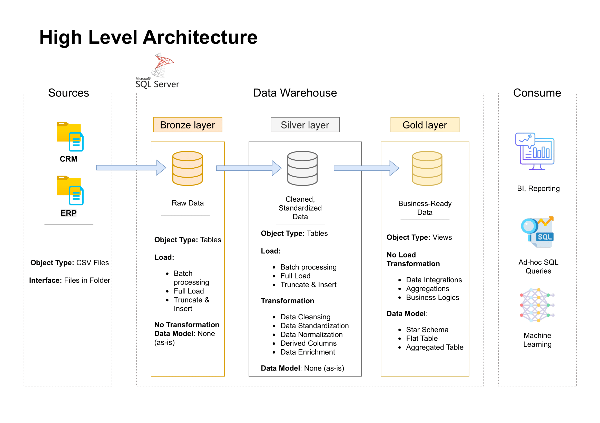

# Project: SQL data warehouse project 
Building a modern data warehouse with SQL Server, including ETL processes, data modeling and data analytics

**Author:** NGUYEN PHAM
**Date:** May 14, 2025
**Contact:** nguyen.pham961309@gmail.com | [https://www.linkedin.com/in/khoinguyenpham/]

---

## 1. Introduction & Objectives

* This project presents a thorough data warehousing and analytics solution, from extracting data sources, integrating into a data warehouse to generating actionable insights using SQL-based queries. 
* The primary objective is to design a portfolio project that demonstrates and highlights good practices in data engineering and analytics.
* This builds upon my experience in the data analytics team at AIA Vietnam - including understanding the data architecture and how the team created impactful analytics to track performance.
* **A great thanks and appreciation to Mr. Baraa Khatib Salkini** and his Youtube channel **Data With Baraa**. His great dedication and efforts contribute to my knowledge while accomplishing this project. 

**Project Overview**
* This project involves:

1. Data Architecture: Designing a Modern Data Warehouse Using Medallion Architecture Bronze, Silver, and Gold layers.
2. ETL Pipelines: Extracting, transforming, and loading data from source systems into the warehouse.
3. Data Modeling: Developing fact and dimension tables optimized for analytical queries.
4. Analytics & Reporting: Creating SQL-based reports and dashboards for actionable insights.

---
## 2. Data Architecture



## 3. Data Sources
This dataset contains 2 csv files.

---

## 3. Tools & Technologies Used
*   **Data Visualization & Dashboarding:** Microsoft Power BI (including DAX for complex measures and calculations)
*   **Data Preparation:** Microsoft Excel (Power Query)
*   **Version Control:** Git & GitHub
*   **Data architecture framework** DrawIO
*   **IDE/Editor (for this README):** Visual Studio Code
*   **Project planning and phases** [Notion](https://www.notion.so/Data-Warehouse-project-20387cc4273f80fa8719c5e7e90f3da7)

---
## 4. Project Requirements
### Building the Data Warehouse (Data Engineering)

**Objective**
- Develop a modern data warehouse using SQL Server to consolidate sales data, enabling analytical reporting and informed decision-making.

**Specifications**
- Data Sources: Import data from two source systems (ERP and CRM) provided as CSV files.
- Data Quality: Cleanse and resolve data quality issues prior to analysis.
- Integration: Combine both sources into a single, user-friendly data model designed for analytical queries.
- Scope: Focus on the latest dataset only; historization of data is not required.
- Documentation: Provide clear documentation of the data model to support both business stakeholders and analytics teams.
---
### BI: Analytics & Reporting (Data Analysis)
**Objective** 
- Develop SQL-based analytics to deliver detailed insights into:

- Customer Behavior
- Product Performance
- Sales Trends
- These insights empower stakeholders with key business metrics, enabling strategic decision-making.
---

### Project Structure

The repository is organized as follows:

```text
PwC Swiss_Nguyen Khoi Nguyen Pham_Churn rate analysis.pbix # The main Power BI file
├── data/                                                 # For the datasets
│   └── 02 Churn-Dataset.csv
├── dax/                                                  # For dax script including measures
│   └── dax_measures and logics.md
├── images/                                               # For screenshots of my dashboard
│   ├── PwC Swiss_Data Analysis by PBI_Nguyen Khoi Nguyen Pham-08.png
│   ├── PwC Swiss_Data Analysis by PBI_Nguyen Khoi Nguyen Pham-09.png
│   ├── Create the dynamic Churning ratio.png
│   ├── Create the tables for static segmentation.png
│   ├── Table of monthly charge.png
│   └── Table of total charge.png
├── .gitignore                                            # Specifies intentionally untracked files
└── README.md                                             # This file!